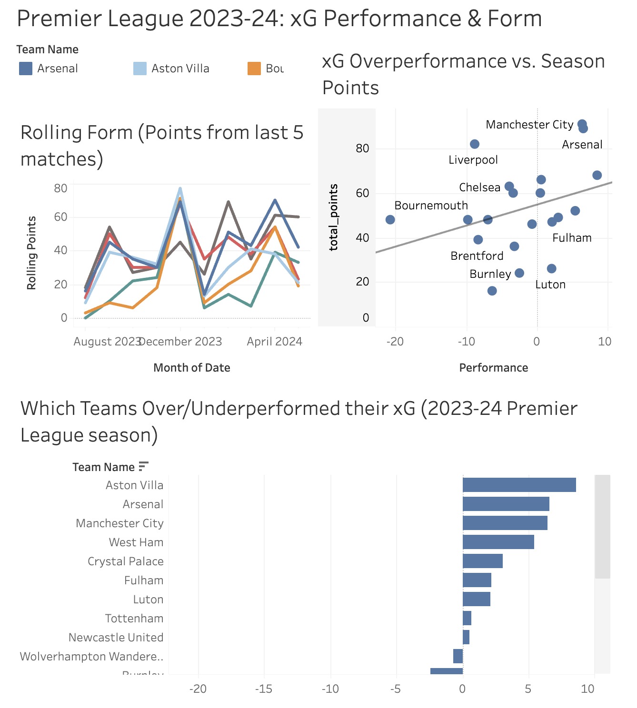

# Premier League xG Performance Analysis (2023-24)

An end-to-end data pipeline analyzing whether expected goals (xG) predicted actual results across a full Premier League season.

## What it does

- Scrapes match-level team data (goals, xG, points, and results) for every team across the 2023-24 PL season
- Loads and cleans data in SQLite
- Provides analysis on three analytical questions: season-long xG over/underperformance, 5-match rolling form, and losses where a team experienced high xG 
- Visualizes the findings in an interactive Tableau dashboard

## Findings

Manchester City and Arsenal both outperformed their xG and ended the season with the highest amount of points. Sheffield United and Luton both underperformed and finished near the bottom of the table. This points to a positive relationship between xG performance and final points, but there were teams that broke the pattern in both directions. Everton was the team that underperformed their xG the most, yet still managed to finish mid-table. 

## Dashboard

[View the interactive dashboard on Tableau Public](https://public.tableau.com/views/PremierLeague2023-24_17902536783660/PremierLeague2023-24xGPerformanceForm?:language=en-US&publish=yes&:sid=&:redirect=auth&:display_count=n&:origin=viz_share_link)



## Tech stack

Python (`requests`, `BeautifulSoup`, `pandas`) · SQLite · SQL (aggregates, 
window functions) · Tableau Public

## A technical note on the scraper

Data comes from Understat rather than a table-based source, pulled via their 
internal `getLeagueData` JSON endpoint (found via browser dev tools) rather 
than parsing rendered HTML — the alternative source considered first (FBRef) 
sits behind Cloudflare bot protection that blocks simple HTTP requests.

## How to run it

1. Clone the repo and create a virtual environment:
    ``` python3 -m venv venv
    source venv/bin/activate
    pip install -r requirements.txt ```
2. Run the scraper: `python src/scraper.py`
   (this scrapes fresh data, loads it into `data/epl_2023.db`, and exports 
   the analysis CSVs to `data/`)
3. SQL queries used for the analysis are in `sql/`, with comments explaining 
   what each answers

## Project structure

├── src/scraper.py # scrape → clean → load → export pipeline
├── sql/ # analytical SQL queries, one per question
├── data/ # SQLite db + exported CSVs (gitignored: raw .db)
└── requirements.txt